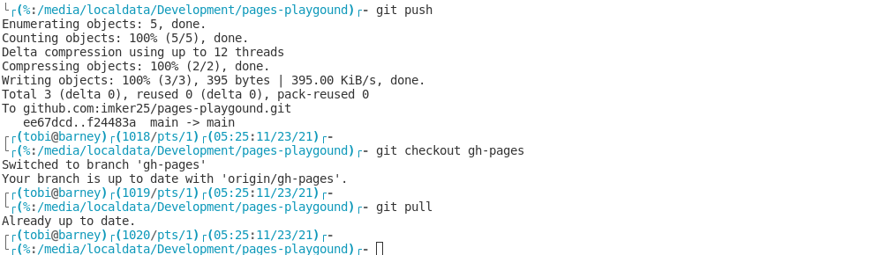

# pages-playgound

Repository to play with github pages and learn how they work 

## Chapter 1

See how `*.md` files gets converted.

Add a image:

A lot of stuff that needs special plugins, like [mermaid](https://mermaid-js.github.io/mermaid/#/) will not work since they need *unsafe* plugins.
