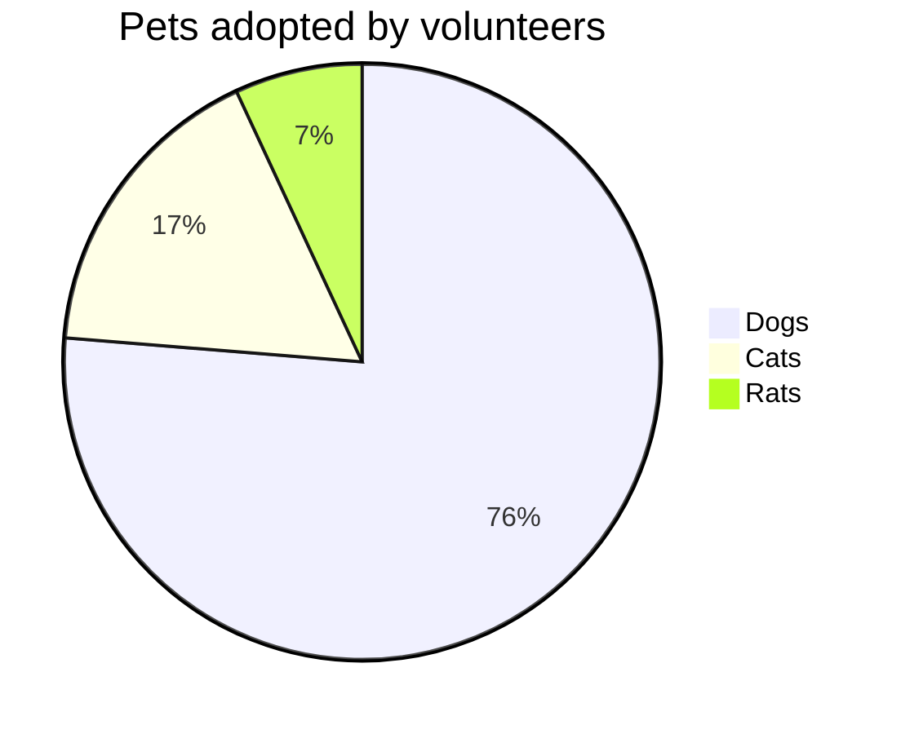

# pages-playgound

Repository to play with github pages and learn how they work 

## Chapter 1

See how `*.md` files gets converted.

Add a image:


Add mermaid support by adding the following to `_config.yml`:

```yaml
plugins:
  - jekyll-spaceship
```

Add a diagram:


