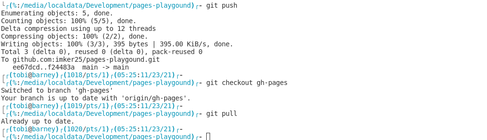

# Imker's GutHub Pages playground

Repository to play with github pages and learn how they work.

Add a image:

## Links

- [To the debian repository](https://imker25.github.io/pages-playgound/repositories/debian/readme)
- [To the example manpage](https://imker25.github.io/pages-playgound/manpages/man.html)